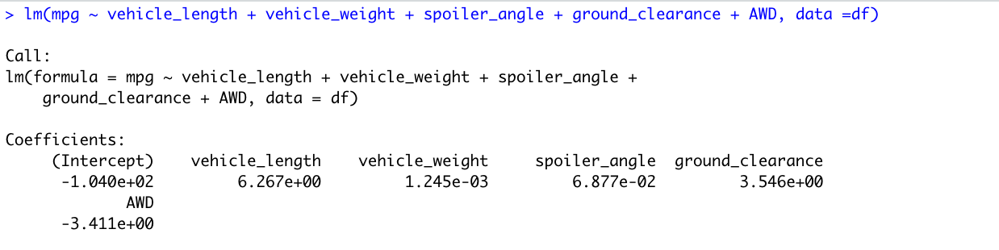
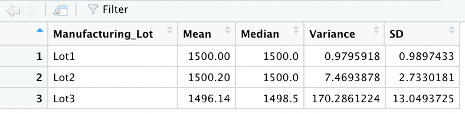
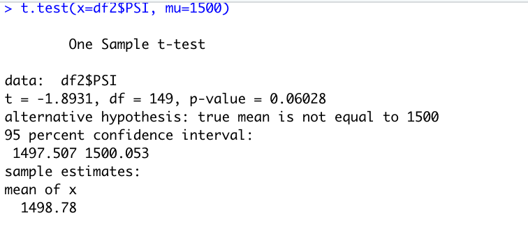
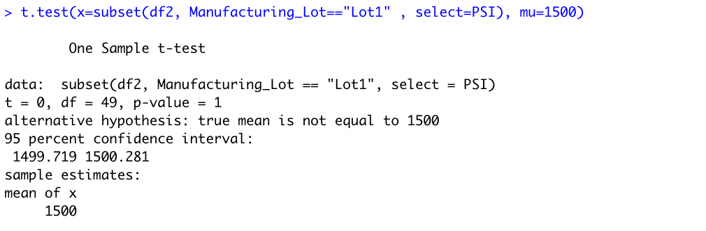
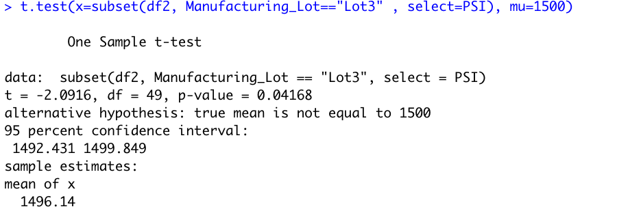

# MechaCar_Statistical_Analysis

## Linear Regression to Predict MPG

Based on the values, the vehicle_lenght, ground_clearance, and AWD are not equal to zero and thus are non-random in their variance.

Is the slope of the linear model considered to be zero? Why or why not?
P-value of our linear regression is 5.53e-11, which is smaller than the significance level of 0.05 assumed here.

Does this linear model predict mpg of MechaCar prototypes effectively? Why or why not?
R-squared value is 0.71, roughly 71% of the variability is explaine by this model. In addition, our p-value is smaller than our assumed number, so there is evidence to say that our slope is not zero. 

## Summary Statistics on Suspension Coils

The design specifications for the MechaCar suspension coils dictate that the variance of the suspension coils must not exceed 100 pounds per square inch. Does the current manufacturing data meet this design specification for all manufacturing lots in total and each lot individually? Why or why not?

The suspension coils variance is met for the total manufacturing lots. 

However, when looking at individual lots, lot3 exceeds the variance.

## T-Tests on Suspension Coils

According to the t-test performed on all the suspension coil data, our p-value is not statistically significant.

Lot one alone has an even higher p-value than all lots combines, which again  is not statistically significant. 

Lot 3 is the only one that has a p-value lower than 0.05, which means it is statistically significant. 

